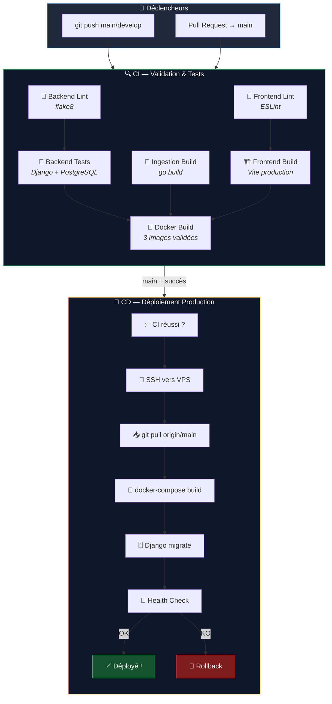

# 🚀 CI/CD Navic — Documentation Complète

> Pipeline d'Intégration Continue et de Déploiement Continu pour la plateforme **Navic GPS Tracking**

---

## 📋 Table des Matières

1. [Vue d'ensemble](#vue-densemble)
2. [Architecture du Pipeline](#architecture-du-pipeline)
3. [Workflow CI — Validation & Tests](#workflow-ci--validation--tests)
4. [Workflow CD — Déploiement Production](#workflow-cd--déploiement-production)
5. [Configuration des Secrets GitHub](#configuration-des-secrets-github)
6. [Guide de démarrage rapide](#guide-de-démarrage-rapide)
7. [Stratégie de branches](#stratégie-de-branches)
8. [Rollback & Récupération](#rollback--récupération)
9. [Dépannage](#dépannage)

---

## Vue d'ensemble

Le pipeline CI/CD de Navic est conçu pour **3 services distincts** déployés via Docker Compose :

| Service | Technologie | Port | Rôle |
|---------|-------------|------|------|
| **Backend** | Django 6 + Daphne (Python 3.12) | 8000 | API REST + WebSockets |
| **Frontend** | React 18 + Vite (Node 20) | 80 | Interface utilisateur SPA |
| **Ingestion** | Go 1.21 | 5027-5038 | Réception GPS (TCP/UDP) |
| **Celery Worker** | Python 3.12 | — | Tâches asynchrones |
| **Celery Beat** | Python 3.12 | — | Tâches planifiées |
| **PostgreSQL** | PostGIS 14 | 5432 | Base de données |
| **Redis** | Redis 6 | 6379 | Cache + Broker Celery |

---

## Architecture du Pipeline



---

## Workflow CI — Validation & Tests

> **Fichier** : [ci.yml](file:///c:/Users/PC/Documents/projets%20dev/navic/.github/workflows/ci.yml)

### Déclenchement

| Événement | Branches | Résultat |
|-----------|----------|----------|
| `push` | `main`, `develop` | CI complet |
| `pull_request` | `main` | CI complet |

### Jobs détaillés

#### 1. 🐍 Backend — Lint (`backend-lint`)

Analyse statique du code Python avec **flake8** :

- **Erreurs critiques** : syntaxe, imports manquants (`E9, F63, F7, F82`) → **bloquant**
- **Qualité du code** : complexité, longueur de ligne → **non bloquant** (warnings)
- Exclut : `__pycache__`, `migrations`, `venv`

#### 2. 🧪 Backend — Tests (`backend-test`)

Tests Django avec une **vraie base PostgreSQL + PostGIS** et **Redis** :

```yaml
Services CI :
  - postgis/postgis:14-3.3-alpine  (port 5432)
  - redis:6-alpine                  (port 6379)
```

Étapes :
1. Installation des dépendances système (`libpq-dev`, `gdal-bin`)
2. Installation des packages Python depuis `requirements.txt`
3. Vérification des migrations Django
4. Check système Django (`manage.py check`)
5. Exécution des tests en parallèle (`manage.py test --parallel`)

> [!NOTE]
> Les services PostgreSQL et Redis sont identiques à ceux utilisés en production pour garantir la fiabilité des tests.

#### 3. 🔧 Ingestion — Build Go (`ingestion-build`)

Compilation et vérification du service d'ingestion GPS :

1. `go mod download` — Téléchargement des dépendances
2. `go vet ./...` — Analyse statique Go
3. `go build` — Compilation du binaire Linux AMD64
4. `go test ./...` — Tests unitaires Go

#### 4. 🎨 Frontend — Lint (`frontend-lint`)

Lint ESLint du code React :
- Utilise `npm ci` (installation déterministe)
- Cache npm pour accélérer les builds

#### 5. 🏗️ Frontend — Build (`frontend-build`)

Build de production Vite/React :
- Vérifie que le build compile sans erreur
- Affiche la taille du bundle

#### 6. 🐳 Docker — Build Images (`docker-build`)

**Déclenché après le succès de tous les autres jobs.** Construit les 3 images Docker sans les pousser :

| Image | Contexte | Dockerfile |
|-------|----------|------------|
| `navic-backend` | `./navic` | `navic/Dockerfile` |
| `navic-ingestion` | `./ingestion` | `ingestion/Dockerfile` |
| `navic-frontend` | `./frontend` | `frontend/Dockerfile` |

Utilise **Docker Buildx** avec cache GitHub Actions (`type=gha`) pour des builds rapides.

### Graphe de dépendances CI

```
backend-lint ──→ backend-test ──┐
                                ├──→ docker-build
ingestion-build ────────────────┤
                                │
frontend-lint ──→ frontend-build┘
```

---

## Workflow CD — Déploiement Production

> **Fichier** : [deploy.yml](file:///c:/Users/PC/Documents/projets%20dev/navic/.github/workflows/deploy.yml)

### Déclenchement

Le déploiement est déclenché **automatiquement** quand :
1. Le workflow CI (`🔍 CI — Validation & Tests`) se termine avec succès
2. Sur la branche `main` uniquement

> [!IMPORTANT]
> Le déploiement ne se lance **jamais** sur `develop` ni sur les Pull Requests. Seul un push (ou merge) sur `main` avec un CI vert déclenche le déploiement.

### Étapes du déploiement

```
1. ✅ Vérification CI       → Le CI a-t-il réussi ?
2. 📌 Sauvegarde commit     → Mémorise le commit actuel pour rollback
3. 📥 Git pull              → git fetch + reset --hard origin/main
4. 🐳 Docker build          → docker-compose build (--parallel)
5. 🐳 Docker up             → docker-compose up -d
6. ⏳ Attente 30s            → Laisser les services démarrer
7. 🗄️ Migrations            → manage.py migrate
8. 📁 Fichiers statiques    → manage.py collectstatic
9. 🏥 Health check          → Vérification de tous les services
10. ✅ Succès OU 🔄 Rollback
```

### Health Check

Le health check vérifie **7 services** :

| Service | Vérification |
|---------|-------------|
| backend | `manage.py check --deploy` + HTTP |
| frontend | `docker-compose ps` |
| ingestion | `docker-compose ps` |
| db | `docker-compose ps` |
| redis | `docker-compose ps` |
| celery_worker | `docker-compose ps` |
| celery_beat | `docker-compose ps` |

### Rollback automatique

Si un service est `DOWN` après le déploiement :

```
❌ ÉCHEC → git reset --hard <commit_précédent>
         → docker-compose up -d --build
         → migrate
         → ✅ État précédent restauré
```

---

## Configuration des Secrets GitHub

### Accéder aux paramètres

```
GitHub → Votre repo → Settings → Secrets and variables → Actions
```

### Secrets requis

| Secret | Description | Exemple |
|--------|-------------|---------|
| `SERVER_IP` | Adresse IP du VPS | `192.168.1.100` |
| `SERVER_USER` | Utilisateur SSH | `root` ou `deploy` |
| `SSH_PRIVATE_KEY` | Clé SSH privée complète | Voir ci-dessous |
| `DEPLOY_PATH` | Chemin du projet sur le VPS | `/opt/navic` |

### Générer et configurer la clé SSH

> [!CAUTION]
> Ne partagez **jamais** votre clé privée. Utilisez une clé dédiée au déploiement.

```bash
# 1. Sur votre machine locale, générer une clé Ed25519 dédiée
ssh-keygen -t ed25519 -C "navic-deploy-ci" -f ~/.ssh/navic_deploy

# 2. Copier la clé PUBLIQUE sur le VPS
ssh-copy-id -i ~/.ssh/navic_deploy.pub deploy@VOTRE_IP_VPS

# 3. Afficher la clé PRIVÉE (à copier dans GitHub Secrets)
cat ~/.ssh/navic_deploy
```

Puis dans GitHub :
1. Allez dans `Settings > Secrets and variables > Actions`
2. Cliquez `New repository secret`
3. Nom : `SSH_PRIVATE_KEY`
4. Valeur : Collez **tout le contenu** du fichier (incluant `-----BEGIN` et `-----END`)

### Créer un environnement de protection (optionnel mais recommandé)

```
GitHub → Settings → Environments → New environment → "production"
```

Options recommandées :
- ✅ **Required reviewers** : Ajoutez-vous comme reviewer pour approuver manuellement
- ✅ **Wait timer** : 0 minutes (ou plus si vous voulez un délai)
- ✅ **Deployment branches** : Seulement `main`

---

## Guide de démarrage rapide

### Prérequis

- [x] Repo GitHub avec les branches `main` et `develop`
- [x] VPS avec Docker et Docker Compose installés
- [x] Le projet cloné sur le VPS dans `/opt/navic`
- [x] Les secrets GitHub configurés

### Étape 1 — Préparer le VPS

```bash
# Sur le VPS
sudo apt update && sudo apt install -y docker.io docker-compose git

# Créer le dossier du projet
sudo mkdir -p /opt/navic
cd /opt/navic

# Cloner le repo
sudo git clone https://github.com/israelledje/navic.git .

# Copier le fichier .env de production
sudo cp navic/.env.example navic/.env
sudo nano navic/.env  # Éditer avec les valeurs de production

# Premier déploiement manuel
chmod +x deploy.sh
./deploy.sh
```

### Étape 2 — Configurer les secrets GitHub

Suivez la section [Configuration des Secrets GitHub](#configuration-des-secrets-github).

### Étape 3 — Pousser du code

```bash
# Flux normal de développement
git checkout develop
git add .
git commit -m "feat: nouvelle fonctionnalité"
git push origin develop              # → CI se lance

# Quand c'est prêt pour la production
git checkout main
git merge develop
git push origin main                 # → CI se lance → CD se déclenche
```

### Étape 4 — Vérifier le pipeline

```
GitHub → Votre repo → Actions → Voir les workflows en cours
```

---

## Stratégie de branches

```mermaid
gitgraph
    commit id: "Initial"
    branch develop
    checkout develop
    commit id: "feat: GPS parser"
    commit id: "fix: auth bug"
    checkout main
    merge develop id: "v1.1.0" tag: "deploy"
    checkout develop
    commit id: "feat: alerts"
    commit id: "feat: billing"
    checkout main
    merge develop id: "v1.2.0" tag: "deploy"
```

### Règles

| Branche | Rôle | CI | CD |
|---------|------|----|----|
| `main` | Production stable | ✅ | ✅ Auto |
| `develop` | Développement actif | ✅ | ❌ |
| `feature/*` | Nouvelles fonctionnalités | Via PR | ❌ |
| `fix/*` | Corrections de bugs | Via PR | ❌ |

### Flux recommandé

```
1. Créer une branche feature/xxx depuis develop
2. Développer et commiter
3. Ouvrir une Pull Request vers develop → CI se lance
4. Merger dans develop après review
5. Quand develop est stable → Merger develop dans main
6. Le push sur main déclenche CI → puis CD automatique
```

> [!TIP]
> Pour les **hotfixes urgents**, vous pouvez créer une branche `fix/xxx` depuis `main`, la merger directement dans `main` via une PR rapide, puis re-merger `main` dans `develop`.

---

## Rollback & Récupération

### Rollback automatique (intégré au CD)

Le pipeline CD inclut un rollback automatique. Si un service échoue après le déploiement :
- Le commit précédent est restauré
- Les conteneurs sont reconstruits avec l'ancien code
- Les migrations sont relancées

### Rollback manuel

Si vous devez revenir en arrière manuellement :

```bash
# Sur le VPS
cd /opt/navic

# Voir les derniers commits
git log --oneline -10

# Revenir à un commit spécifique
git reset --hard <COMMIT_HASH>

# Reconstruire et redémarrer
docker-compose up -d --build
docker-compose exec -T backend python manage.py migrate
docker-compose exec -T backend python manage.py collectstatic --noinput
```

### Rollback via GitHub

```bash
# Sur votre machine locale
git revert HEAD          # Créer un commit qui annule le dernier
git push origin main     # Le CI/CD va redéployer l'état précédent
```

---

## Dépannage

### Le CI échoue

| Problème | Solution |
|----------|----------|
| `flake8` erreurs | Corriger les erreurs de syntaxe Python |
| Tests Django échouent | Vérifier les tests localement : `python manage.py test` |
| `npm run build` échoue | Vérifier les erreurs TypeScript/JSX |
| `go build` échoue | Vérifier la syntaxe Go : `go vet ./...` |
| Docker build échoue | Vérifier les Dockerfiles et les dépendances |

### Le CD échoue

| Problème | Solution |
|----------|----------|
| SSH timeout | Vérifier `SERVER_IP` et le pare-feu du VPS |
| Permission denied | Vérifier `SSH_PRIVATE_KEY` et `SERVER_USER` |
| Docker build lent | Le cache Docker devrait accélérer les builds suivants |
| Migration échoue | Se connecter au VPS et debugger manuellement |
| Health check KO | Vérifier les logs : `docker-compose logs --tail=50` |

### Commandes utiles sur le VPS

```bash
# Voir les logs de tous les services
docker-compose logs -f

# Voir les logs d'un service spécifique
docker-compose logs -f backend

# Voir l'état des conteneurs
docker-compose ps

# Redémarrer un service
docker-compose restart backend

# Accéder au shell Django
docker-compose exec backend python manage.py shell

# Voir les dernières actions GitHub (si gh CLI installé)
gh run list --limit 5
```

> [!WARNING]
> Ne modifiez **jamais** le code directement sur le VPS. Toute modification sera écrasée au prochain déploiement (`git reset --hard`). Faites toujours vos changements via Git.

---

## Résumé des fichiers

| Fichier | Rôle |
|---------|------|
| [ci.yml](file:///c:/Users/PC/Documents/projets%20dev/navic/.github/workflows/ci.yml) | Pipeline CI — 6 jobs de validation |
| [deploy.yml](file:///c:/Users/PC/Documents/projets%20dev/navic/.github/workflows/deploy.yml) | Pipeline CD — Déploiement VPS avec rollback |
| [deploy.sh](file:///c:/Users/PC/Documents/projets%20dev/navic/deploy.sh) | Script de déploiement exécuté sur le VPS |
| [docker-compose.yml](file:///c:/Users/PC/Documents/projets%20dev/navic/docker-compose.yml) | Orchestration des 7 services Docker |
